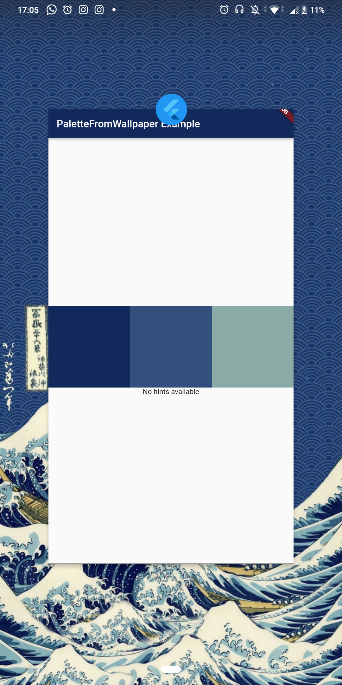
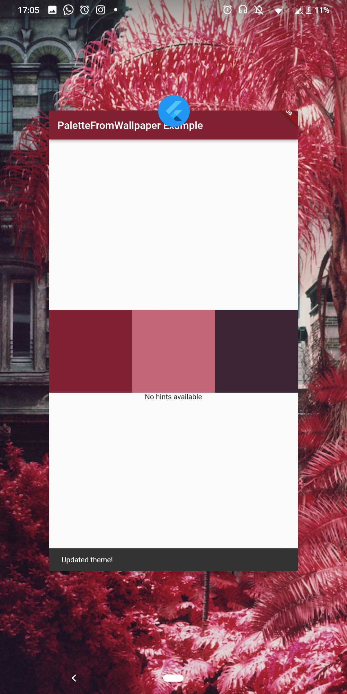

# palette_from_wallpaper_example

Demonstrates how to use the palette_from_wallpaper plugin.

It shows the usage of runPlatformThemedApp and the lower level
PaletteFromWallpaper.paletteUpdates event stream.

## Screenshots

